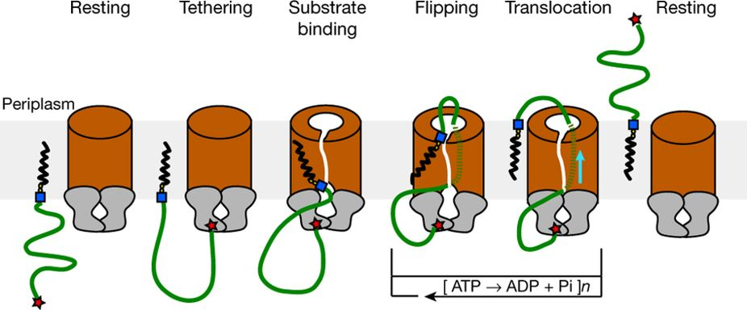

# Group Meeting
## Jennifer M. Hays
## 6/26/2019

# Outline
1. New system and experimental data!
2. Why this system is useful for testing some new methods.
3. How we're going to do the tests.  **(This is mostly for Eric.)**

#### The Wzm-Wzt ABC transporter moves O-antigen from cytosol to periplasm

<small>proposed model of O-antigen transport from Bi et al., <em>Nature</em> 2018</small>

## Wzm-Wzt Structure

- Transporter is composed of three domains: Wzm, Wzt, and a carbohydrate-binding domain (CBD)
- No one knows exactly **how the CBD is oriented with respect to Wzt**

